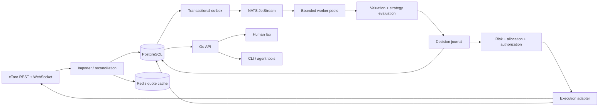

# Architecture

Status: chosen direction for the lab. The runnable foundation is narrower; see [delivery status](roadmap.md). Research: [source notes](research/2026-09-25-foundations.md).

## What a user must be able to answer

1. What do I own, in which account and strategy, valued when and from which source?
2. What changed, who initiated it, why, and what was actually executed?
3. Which strategy version earned its result after costs, against which baseline?
4. What is running now, what can it spend, and how do I pause it?
5. Are the local book and eToro in agreement?

## Deployment

Start with a modular Go application and bounded background workers. Keep module boundaries clean without creating a fleet of microservices. The same image can later run API, importer, research worker or executor roles. The executor will be isolated before live credentials are introduced.

PostgreSQL is authoritative. Redis can be emptied without losing decisions or money. NATS carries work and events; consumers acknowledge only after durable effects commit. Market history moves to compressed Parquet/object storage once measured retention justifies it; avoid adding another database now.

The Compose baseline is one host, one replica per dependency, persistent volumes and localhost-only HTTP ports. It is a development topology, not high availability. PostgreSQL backups and tested restores precede live operation. No public deployment until authentication, TLS and secrets management exist.

## Modules and contracts

| Module | Owns | Must not do |
| --- | --- | --- |
| Market data | Provider IDs, quote/bar normalization, event and receive times, gaps, source lineage, calendars | Invent missing prices or silently mix feeds |
| Portfolio | Journal, cash reservations, lots, sleeves, capital flows, corporate actions | Treat an order acknowledgment as a fill |
| Valuation | Decimal arithmetic, mark policy, FX, P&L, exposure, snapshot lineage | Hide missing/stale marks inside apparently current NAV |
| Research | Strategy versions, datasets, runs, baselines, evaluation artifacts | Change a historical run when code or data changes |
| Decisions | Proposal, evidence, alternatives, checks, authorization, outcomes | Present generated explanation as proof |
| Risk | Account and sleeve limits, price freshness, execution budget, kill state | Delegate limits or arithmetic to a model |
| Execution | Broker capability mapping, submit/cancel/close, broker ID binding, uncertain results | Automatically retry an ambiguous order submission |
| Reconciliation | Broker snapshots/events, differences, corrections and resolutions | Delete discrepancies or rewrite historical facts |
| Lab API | Human and agent operations, progress, exports, errors | Give agents a hidden route around permissions |

## Market ingestion

The first production provider is eToro. Subscribe only to instruments held, watched or needed by active strategies. Bootstrap metadata and holdings via REST, stream bid/ask and private execution updates, periodically reconcile via REST. On disconnect: exponential backoff with jitter, resubscribe, fetch snapshots, record a gap and block new exposure until checks pass.

Every event carries an internal ID, schema version, provider ID, instrument identity, event time, receive time, correlation/causation IDs and raw payload reference. Normalize decimals from strings. Reject invalid/crossed quotes; quarantine schema failures. Handle duplicates and out-of-order events explicitly. Never forward-fill indefinitely. Historical backfills and live streams use the same normalizer but separate quotas and queues.

## Queue and worker plan

Separate subjects for market ingestion, valuation, research, reconciliation and execution. Use bounded pull consumers, per-job timeout, cancellation, attempt counters and dead-letter records visible in the UI. Retry transient reads; quarantine invalid payloads. Reserve execution/reconciliation capacity so a large backtest cannot starve them.

Use a PostgreSQL outbox for state changes that also enqueue work. Consumer effect IDs are unique in PostgreSQL. Serialize execution and reservations per broker account; use optimistic versions for sleeve mutations. Throughput workers may reorder messages, so chronological instrument projections need sequence checks. NATS deduplication is only a short-term optimization.

The initial fixture replay implements an outbox and a shared durable pull consumer with a bounded pool. It retries transient processing failures and exposes pending work. General scheduling, cancellation and dead-letter administration are milestones, not existing features.

## Interfaces for people and agents

The same versioned HTTP API serves both. Start with embedded HTML/CSS/JavaScript and plain Go handlers, avoiding a separate frontend build just for tables and forms. Add richer chart tooling only where it helps compare results.

Planned human views: account overview; sleeve allocation; strategy registry/comparison; chronological decision journal; proposal review; order/fill trail; reconciliation inbox; data freshness; jobs and infrastructure. Each number has currency, as-of time and provenance. Each action shows actor, scope, before/after change, status and a plain explanation. Empty and degraded states are first-class.

Agents get typed requests, stable errors, cursor pagination, bounded bulk operations, dry-run previews, idempotency keys, job status and artifact exports. An MCP adapter may wrap these endpoints later. They may create many experiments within assigned compute/data budgets; live capital permissions remain independent. A human can inspect and stop any run without reading prompts or server logs.

## Permissions and secrets

Planned roles: observer, researcher, paper operator, live approver and executor. Bind approvals to a proposal hash, policy version, account, maximum amount and expiry. Recheck current prices/reservations at submission. Agents cannot approve themselves or widen their capabilities. The executor holds write credentials; model providers receive a minimal redacted state. Keys never enter prompts, browser storage, fixtures or repository history.

Pause means stop new work; cancel means request cancellation of outstanding orders; flatten means a separate explicit close action. These must never be interchangeable. Risk-reducing exits have their own validated path even when an optional model provider is unavailable.
