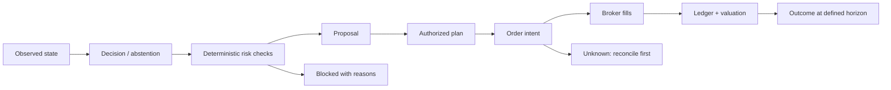

# Portfolio and decision model

This is the target domain design. The foundation only replays fixed unlevered USD fixture holdings and records valuations/decisions; it does not implement the journal below yet.

## Accounts, sleeves and simulations

- **Broker account:** an actual eToro account, identified separately by environment and credential scope.
- **Sleeve:** an internal attribution of capital and lots within one broker account. A sleeve does not create broker-side isolation.
- **Simulation:** an independent book with its own capital. Never include it in actual account totals.
- **Broker Agent Portfolio:** optional eToro construct. Store its ID, mirror relationship and explicit scaling rules independently of sleeves.

Example: $10,000 account = $6,000 core sleeve + $3,000 experimental sleeve + $1,000 unassigned. A separate $10,000 simulation adds nothing to actual equity. Two strategies sharing a sleeve do not both receive its entire capital for return attribution.

Account cash, units and expenses must equal sleeve sums plus an unassigned bucket within documented rounding tolerances. Existing/manual eToro trades enter unassigned until attributed. Deposits and withdrawals are capital flows, not strategy profit. Transfers between sleeves use paired journal entries with a chosen transfer mark; they do not realize broker profit or create investment returns.

## Durable entities

| Entity | Essential fields and relationships |
| --- | --- |
| account | broker, external account ID, environment, base currency, capabilities |
| sleeve / capital mandate | account, policy version, budget, benchmark, lifecycle, valid-from/to |
| instrument | provider mapping, currency, product kind, exchange/calendar, tick and lot precision |
| journal transaction / postings | effective/recorded time, currency or unit commodity, balanced entries, source event, correction link |
| broker lot / allocation | position ID, product/leverage, open quantity, unit cost, sleeve ownership, reservation |
| quote / FX mark | source, bid/ask, event/receive time, quality, snapshot reference |
| valuation snapshot | account/sleeve, policy version, input IDs, NAV, cash, P&L, gross/net exposure, quality |
| strategy version | immutable source revision, parameters, universe, dependencies, digest |
| run | mode, strategy/dataset/policy versions, seed, clock range, compute budget, baseline, status |
| decision | run, actor, as-of snapshot, action/alternatives, reasons, model details, checks, intended horizon |
| proposal / approval | decision, exact order plan/hash, approver, expiry, permitted amount, status |
| order intent / attempts | stable local intent ID, broker IDs, request digest, timestamps, uncertain-result state |
| fill / fees | immutable broker event ID, quantity, price, commissions/FX/financing, lot binding |
| reconciliation | observed and expected values, difference, severity, evidence, resolution/correction |
| outcome | decision, evaluation horizon, realized result, counterfactual method, cost, data-quality flag |

Use PostgreSQL NUMERIC and decimal Go values for money/quantity; serialize decimals as JSON strings. Use UTC timestamps with event time and recorded time. Corrections append compensating entries. Migration permissions and application roles must prevent ordinary updates/deletes of audit records; cryptographic anchoring is a later option, not a promise of tamper-proof storage.

## Pricing and performance

Use midpoint for analytical mark-to-market and bid for liquidation value of longs / ask for shorts. Display both policies explicitly. A complete valuation requires marks and FX for every included asset; missing data yields an incomplete result rather than a false total. Closed-market marks may be valid last-close marks under a calendar policy; they are not fresh executable quotes.

Unlevered long: market value = units × mark; unrealized P&L = market value − remaining cost basis. Cash plus spot market value can form NAV for this restricted book. CFDs/shorts require invested margin, direction, contract multipliers, financing and liabilities; do not reuse the spot formula. Reconcile broker-reported and internally computed valuation separately.

Include commissions, spreads, slippage, FX conversion, funding/overnight charges, dividends and taxes where supplied. Preserve gross and net results. Allocation of partial fills and fees to sleeves uses a deterministic rule fixed before execution; rounding residuals have an explicit owner. Reject over-allocation and reserve capital atomically.

Track NAV, realized/unrealized P&L, cash/reserved cash, drawdown, exposure, turnover and costs. For comparison add time-weighted returns, money-weighted returns where appropriate, benchmark-relative results, volatility and risk metrics with sampling assumptions. Never annualize a tiny fixture run or label mark movement as realized performance.

## Decision trail

Record HOLD, rejection, abstention and failed evaluations as well as trades. Store evidence references, code/model/question versions, full typed answers, probability distribution, provider latency/cost, policy checks and human overrides. Explanations are concise summaries of captured evidence and checks; do not fabricate a model's internal reasoning.

Each intent has at most one active submit attempt. An HTTP success is not proof of a fill. Partial fills, cancel/fill races, asynchronous rejections and externally initiated trades all enter the same execution journal. Broker event uniqueness and transactional projections prevent duplicate accounting effects. An uncertain submission freezes that intent and its reservation until broker state resolves it.

## Strategy lab

Lifecycle: draft → deterministic replay → historical backtest → shadow → paper → broker demo → limited live → retired. Each promotion preserves the evidence and requires the relevant gate; a good backtest alone does not authorize live trading.

Runs pin data snapshots, source revisions, universe membership, costs, model/question versions, seed, execution assumptions and time boundaries. Use as-of joins, delisting/corporate-action handling, separate training/validation/test periods and walk-forward evaluation. Check look-ahead and survivorship bias. Replay captured model outputs for reproducibility; re-querying a changing external model is a different run.

Compare against cash, buy-and-hold and a deterministic version without AI. Record all experiments, including failures, to expose selection bias. Account for spread, costs, latency and missed fills. Label counterfactual results as estimates. Calibrate probability outputs against predetermined outcomes; model confidence and trade hit rate are different statistics.
